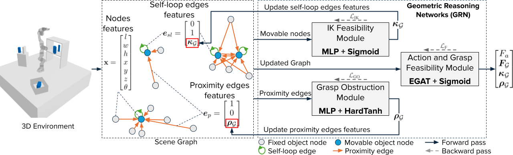

# Geometric Reasoning Networks (GRN)
This is the official repository for the ICLR 2025 conference paper: "Learning Geometric Reasoning Networks for Robot Task and Motion Planning".



## Installation (Docker)
A CUDA runtime image and all dependencies are provided via `Dockerfile`.

Pre-requisites
- Docker
- NVIDIA Container Toolkit (for GPU support)

1) Clone the repository:
```bash
git clone https://github.com/smail8/geometric_reasoning_networks.git
cd geometric_reasoning_networks
```

2) Build the image:
```bash
sudo docker build -t grn:latest .
```

3) Run with GPU and mount the project:
```bash
sudo docker run --gpus all \
  --name grn \
  --shm-size=1g \
  -p 8090:8090 \
  -v "${PWD}:/GRN" \
  -w /GRN \
  -it grn:latest bash
```

Inside the container you can run all the commands below directly. The image already installs `requirements.txt`.

## Installation (Local)
1) Clone the repository:
```bash
git clone https://github.com/smail8/geometric_reasoning_networks.git
cd geometric_reasoning_networks
```

2) Create and activate a virtual environment

```bash
python3.8 -m venv .grn
source .grn/bin/activate
python3 -m pip install --upgrade pip
```

3) Install dependencies

```bash
pip install -r requirements.txt
```

Notes
- PyTorch + CUDA must match your driver. The requirements pin torch==2.2.2 and torch_geometric==2.5.2.
- If torch-geometric reports wheel issues, consult https://pytorch-geometric.readthedocs.io/ for extra packages.
- This installation is tested on Ubuntu 20.04 with NVIDIA drivers 550 and CUDA 12.4.

## Repository layout

- `process_data.py` — process raw annotations into tabular data for training
- `generate_projections.py` — create sparse top/front/rear/right/left projections per scene
- `Dataset.py` — dataset loaders for GRN/GO/IK/baselines
- `base_gnn.py`, `Network.py`, `NetworkLit.py` — models and Lightning wrappers
- `train_ik.py`, `train_go.py`, `train_agf.py`, `train_grn.py`, `train_baselines.py` — training entry points
- `test_grn.py` — example testing/evaluation for GRN
- `visualize_scene.py` — Flask + Plotly scene viewer (port 8090)

## Data download and processing

1) Download Datasets from HuggingFace:
```bash
git clone https://huggingface.co/datasets/Smile8/GRN_datasets
```

We provide 3 main datasets: `panda_3d_4`, `panda_tabletop_4` and `pr2_3d_4`, and 3 additional out-of-distribution testing datasets: `panda_3d_10`, `panda_3d_15` and `panda_3d_20`.

2) Unzip the downloaded datasets:
```bash
unzip GRN_datasets/<dataset_name>.zip -d GRN_datasets/<dataset_name>
```

3) Process the datasets (Run once per dataset):
```bash
python3 process_data.py --path GRN_datasets/<dataset_name>
```

4) Generate scene projections (Optional, for CNN-based baselines only):
```bash
python3 generate_projections.py --path GRN_datasets/<dataset_name>
```

Datasets are structured as:
```
panda_3d_4/
  train_set/
    data/
      processed_gnn_data.json
      processed_go_data.json
      GO_inputs.pt
      GO_labels.pt
      GO_masks.pt
    scenes/<scene_id>.json
    projections/                # created by generate_projections.py
      base_value.pt
      <scene_id>.pt
    processed
  val_set/
    data/
      processed_gnn_data.json
      processed_go_data.json
      GO_inputs.pt
      GO_labels.pt
      GO_masks.pt
    scenes/<scene_id>.json
    projections/
  test_set/
    data/
      processed_gnn_data.json
      processed_go_data.json
      GO_inputs.pt
      GO_labels.pt
      GO_masks.pt
    scenes/<scene_id>.json
    projections/
```
- `scenes/*.json` are raw scene descriptions
- `data/processed_gnn_data.json` is produced by `process_data.py`
- `projections/*.pt` are sparse tensors created by `generate_projections.py`

## Open weights
Download pre-trained weights from HuggingFace:
```bash
git clone https://huggingface.co/Smile8/GRN_models
```

## Training

General tips
- Adjust `--batch_size` to fit your GPU/CPU memory
- Set `--device cuda` or `--device cpu` as needed

We provide a bash script to simplify training using the same hyperparameters as ours:
```bash
bash train.sh --dataset_path="<PATH_TO_DATASET>"
```
This script will run training of each module one by one as well as the final joint fine-tuning.

Users who want to train each module individually using custom hyperparameters can do so by running each training script directly:
- IK Feasibility (IK) Module:
```bash
python3 train_ik.py \
  --dataset_path "<PATH_TO_DATASET>" \
  --device "<DEVICE>" \
  --n_epochs 100 \
  --batch_size 8192 \
  --lr 1e-3 \
```

- Grasp Obstruction (GO) Module:
```bash
python3 train_go.py \
  --dataset_path "<PATH_TO_DATASET>" \
  --device "<DEVICE>" \
  --n_epochs 100 \
  --batch_size 8192 \
  --lr 1e-3 \
```

- Action and Grasp Feasibility (AGF) Module:
```bash
python3 train_agf.py \
  --dataset_path "<PATH_TO_DATASET>" \
  --device "<DEVICE>" \
  --IK_GO_mode "gt" \
  --n_epochs 100 \
  --batch_size 512 \
  --lr 1e-4 \
```

- Geometric Reasoning Network (GRN):
```bash
python3 train_grn.py \
  --dataset_path "<PATH_TO_DATASET>" \
  --device "<DEVICE>" \
  --IK_GO_mode "predict" \
  --n_epochs 100 \
  --batch_size 512 \
  --lr 1e-4 \
```

For training baselines (MLP, DVH, AGFPNet, GCN, GAT), use:
```bash
python3 train_baselines.py \
  --dataset_path "<PATH_TO_DATASET>" \
  --model "<Baselines>" \
  --device "<DEVICE>" \
  --n_epochs 100 \
  --batch_size 256 \
  --lr 1e-4 \
```
Replace `--model` with one of: `MLP`, `DVH`, `AGFPNet`, `GCN`, `GAT`.


## Testing / Evaluation

GRN example:
```bash
python3 test_grn.py --dataset_path "<PATH_TO_DATASET>" --model_path "<PATH_TO_MODEL_WEIGHTS>" --device "<DEVICE>"
```

## Scene visualization (optional)

Serve a single scene JSON with Flask + Plotly on port 8090:
```bash
python3 visualize_scene.py --path <PATH_TO_DATASET>/test_set/scenes/<scene_id>.json
```
Open http://localhost:8090 in your browser.

With Docker, ensure the port is mapped (`-p 8090:8090`).

## Prediction visualization (optional)
Coming soon.

## License

See `LICENSE`.


## Citation
Please remember to cite our work.
```bibtex
@inproceedings{ait2025learning,
  title={Learning Geometric Reasoning Networks for Robot Task and Motion Planning},
  author={Ait Bouhsain, Smail and Alami, Rachid and Simeon, Thierry},
  booktitle={The Thirteenth International Conference on Learning Representations},
  year={2025}
}
```